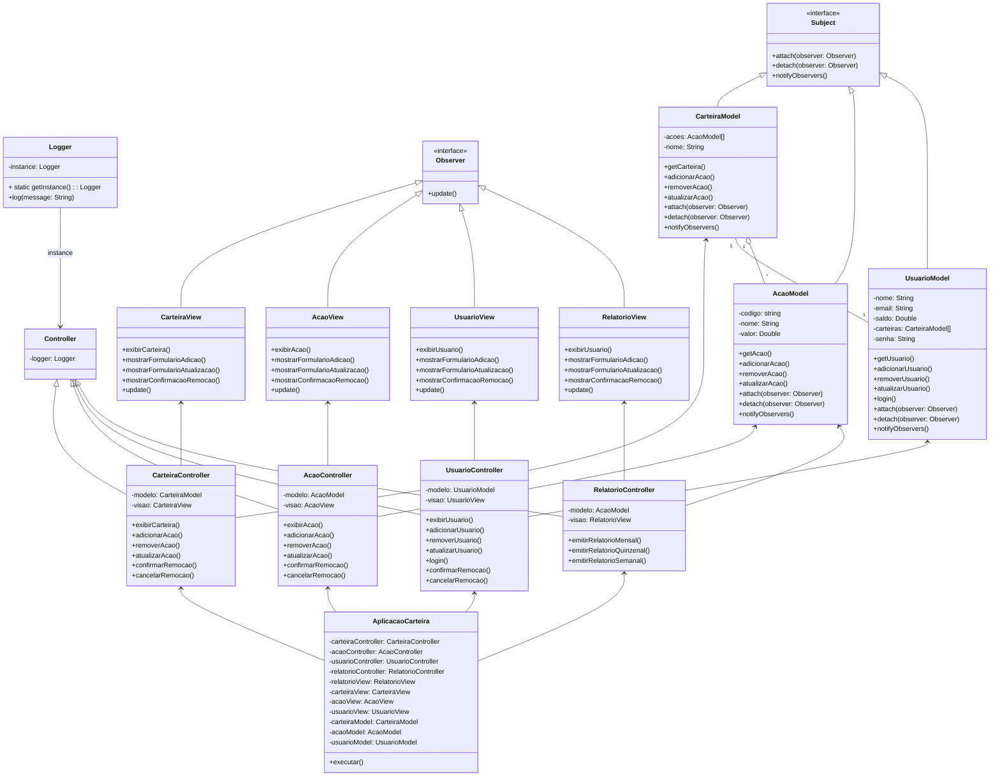

```mermaid
classDiagram

  class Logger {
    -instance: Logger
    + static getInstance(): Logger
    +log(message: String)
  }

  class Observer {
    <<interface>>
    +update()
  }

  class Subject {
    <<interface>>
    +attach(observer: Observer)
    +detach(observer: Observer)
    +notifyObservers()
  }

  class CarteiraModel {
    -acoes: AcaoModel[]
    -nome: String
    +getCarteira()
    +adicionarAcao()
    +removerAcao()
    +atualizarAcao()
    +attach(observer: Observer)
    +detach(observer: Observer)
    +notifyObservers()
  }

  class CarteiraView {
    +exibirCarteira()
    +mostrarFormularioAdicao()
    +mostrarFormularioAtualizacao()
    +mostrarConfirmacaoRemocao()
    +update()
  }

  class CarteiraController {
    -modelo: CarteiraModel
    -visao: CarteiraView
    +exibirCarteira()
    +adicionarAcao()
    +removerAcao()
    +atualizarAcao()
    +confirmarRemocao()
    +cancelarRemocao()
  }

  class AcaoModel {
    -codigo: string
    -nome: String
    -valor: Double
    +getAcao()
    +adicionarAcao()
    +removerAcao()
    +atualizarAcao()
    +attach(observer: Observer)
    +detach(observer: Observer)
    +notifyObservers()
  }

  class AcaoView {
    +exibirAcao()
    +mostrarFormularioAdicao()
    +mostrarFormularioAtualizacao()
    +mostrarConfirmacaoRemocao()
    +update()
  }

  class AcaoController {
    -modelo: AcaoModel
    -visao: AcaoView
    +exibirAcao()
    +adicionarAcao()
    +removerAcao()
    +atualizarAcao()
    +confirmarRemocao()
    +cancelarRemocao()
  }

  class UsuarioModel {
    -nome: String
    -email: String
    -saldo: Double
    -carteiras: CarteiraModel[]
    -senha: String
    +getUsuario()
    +adicionarUsuario()
    +removerUsuario()
    +atualizarUsuario()
    +login()
    +attach(observer: Observer)
    +detach(observer: Observer)
    +notifyObservers()
  }

  class UsuarioView {
    +exibirUsuario()
    +mostrarFormularioAdicao()
    +mostrarFormularioAtualizacao()
    +mostrarConfirmacaoRemocao()
    +update()
  }

  class UsuarioController {
    -modelo: UsuarioModel
    -visao: UsuarioView
    +exibirUsuario()
    +adicionarUsuario()
    +removerUsuario()
    +atualizarUsuario()
    +login()
    +confirmarRemocao()
    +cancelarRemocao()
  }

  class RelatorioView {
    +exibirUsuario()
    +mostrarFormularioAdicao()
    +mostrarFormularioAtualizacao()
    +mostrarConfirmacaoRemocao()
    +update()
  }

  class RelatorioController {
    -modelo: AcaoModel
    -visao: RelatorioView
    +emitirRelatorioMensal()
    +emitirRelatorioQuinzenal()
    +emitirRelatorioSemanal()
  }

  class Controller {
    -logger: Logger
  }

  class AplicacaoCarteira {
    -carteiraController: CarteiraController
    -acaoController: AcaoController
    -usuarioController: UsuarioController
    -relatorioController: RelatorioController
    -relatorioView: RelatorioView
    -carteiraView: CarteiraView
    -acaoView: AcaoView
    -usuarioView: UsuarioView
    -carteiraModel: CarteiraModel
    -acaoModel: AcaoModel
    -usuarioModel: UsuarioModel
    +executar()
  }

  Observer <|-- CarteiraView
  Observer <|-- AcaoView
  Observer <|-- UsuarioView
  Observer <|-- RelatorioView

  Subject <|-- CarteiraModel
  Subject <|-- AcaoModel
  Subject <|-- UsuarioModel

  Controller <|-- CarteiraController
  Controller <|-- AcaoController
  Controller <|-- UsuarioController
  Controller <|-- RelatorioController

  CarteiraModel <-- CarteiraController
  CarteiraView <-- CarteiraController
  CarteiraController <-- AplicacaoCarteira

  AcaoModel <-- AcaoController
  AcaoView <-- AcaoController
  AcaoController <-- AplicacaoCarteira

  UsuarioModel <-- UsuarioController
  UsuarioView <-- UsuarioController
  UsuarioController <-- AplicacaoCarteira

  AcaoModel <-- RelatorioController
  RelatorioView <-- RelatorioController
  RelatorioController <-- AplicacaoCarteira
  
  CarteiraModel "1" -- "1" UsuarioModel
  CarteiraModel "1" o-- "*" AcaoModel
  Logger --> Controller: instance
```