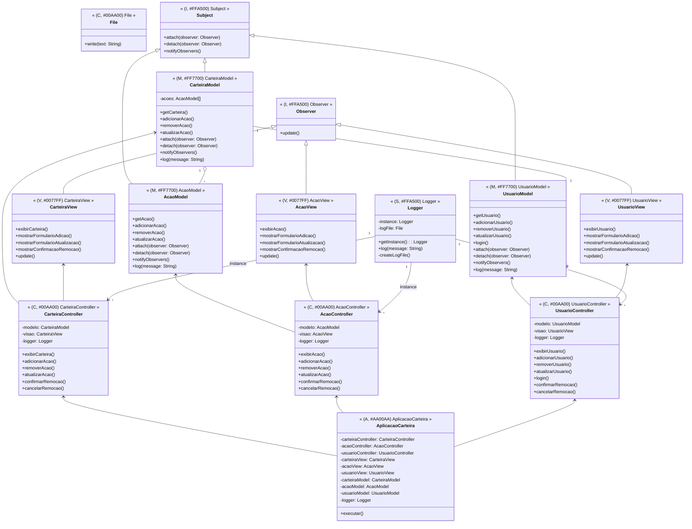

```mermaid
classDiagram

  class Logger {
    << (S, #FFA500) Logger >>
    -instance: Logger
    -logFile: File
    +getInstance(): Logger
    +log(message: String)
    -createLogFile()
  }

  class File {
    << (C, #00AA00) File >>
    +write(text: String)
  }

  class Observer {
    << (I, #FFA500) Observer >>
    +update()
  }

  class Subject {
    << (I, #FFA500) Subject >>
    +attach(observer: Observer)
    +detach(observer: Observer)
    +notifyObservers()
  }

  class CarteiraModel {
    << (M, #FF7700) CarteiraModel >>
    +getCarteira()
    +adicionarAcao()
    +removerAcao()
    +atualizarAcao()
    -acoes: AcaoModel[]
    +attach(observer: Observer)
    +detach(observer: Observer)
    +notifyObservers()
    +log(message: String)
  }

  class CarteiraView {
    << (V, #0077FF) CarteiraView >>
    +exibirCarteira()
    +mostrarFormularioAdicao()
    +mostrarFormularioAtualizacao()
    +mostrarConfirmacaoRemocao()
    +update()
  }

  class CarteiraController {
    << (C, #00AA00) CarteiraController >>
    -modelo: CarteiraModel
    -visao: CarteiraView
    -logger: Logger
    +exibirCarteira()
    +adicionarAcao()
    +removerAcao()
    +atualizarAcao()
    +confirmarRemocao()
    +cancelarRemocao()
  }

  class AcaoModel {
    << (M, #FF7700) AcaoModel >>
    +getAcao()
    +adicionarAcao()
    +removerAcao()
    +atualizarAcao()
    +attach(observer: Observer)
    +detach(observer: Observer)
    +notifyObservers()
    +log(message: String)
  }

  class AcaoView {
    << (V, #0077FF) AcaoView >>
    +exibirAcao()
    +mostrarFormularioAdicao()
    +mostrarFormularioAtualizacao()
    +mostrarConfirmacaoRemocao()
    +update()
  }

  class AcaoController {
    << (C, #00AA00) AcaoController >>
    -modelo: AcaoModel
    -visao: AcaoView
    -logger: Logger
    +exibirAcao()
    +adicionarAcao()
    +removerAcao()
    +atualizarAcao()
    +confirmarRemocao()
    +cancelarRemocao()
  }

  class UsuarioModel {
    << (M, #FF7700) UsuarioModel >>
    +getUsuario()
    +adicionarUsuario()
    +removerUsuario()
    +atualizarUsuario()
    +login()
    +attach(observer: Observer)
    +detach(observer: Observer)
    +notifyObservers()
    +log(message: String)
  }

  class UsuarioView {
    << (V, #0077FF) UsuarioView >>
    +exibirUsuario()
    +mostrarFormularioAdicao()
    +mostrarFormularioAtualizacao()
    +mostrarConfirmacaoRemocao()
    +update()
  }

  class UsuarioController {
    << (C, #00AA00) UsuarioController >>
    -modelo: UsuarioModel
    -visao: UsuarioView
    -logger: Logger
    +exibirUsuario()
    +adicionarUsuario()
    +removerUsuario()
    +atualizarUsuario()
    +login()
    +confirmarRemocao()
    +cancelarRemocao()
  }

  class AplicacaoCarteira {
    << (A, #AA00AA) AplicacaoCarteira >>
    -carteiraController: CarteiraController
    -acaoController: AcaoController
    -usuarioController: UsuarioController
    -carteiraView: CarteiraView
    -acaoView: AcaoView
    -usuarioView: UsuarioView
    -carteiraModel: CarteiraModel
    -acaoModel: AcaoModel
    -usuarioModel: UsuarioModel
    -logger: Logger
    +executar()
  }

  Observer <|-- CarteiraView
  Observer <|-- AcaoView
  Observer <|-- UsuarioView

  Subject <|-- CarteiraModel
  Subject <|-- AcaoModel
  Subject <|-- UsuarioModel

  CarteiraModel <-- CarteiraController
  CarteiraView <-- CarteiraController
  CarteiraController <-- AplicacaoCarteira

  AcaoModel <-- AcaoController
  AcaoView <-- AcaoController
  AcaoController <-- AplicacaoCarteira

  UsuarioModel <-- UsuarioController
  UsuarioView <-- UsuarioController
  UsuarioController <-- AplicacaoCarteira

  CarteiraModel "1" -- "1" UsuarioModel
  CarteiraModel "1" o-- "*" AcaoModel
  Logger "1" --> "*" CarteiraController: instance
  Logger "1" --> "*" AcaoController: instance
  Logger "1" --> "*" UsuarioController: instance


```